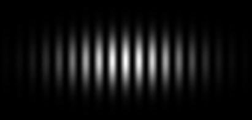
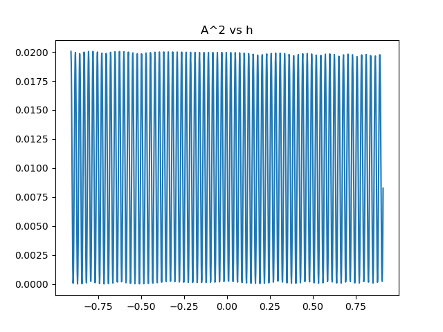

# Experimento de la doble rendijas

  

## **Proyecto realizado para el curso de Óptica y Ondas (experimento de doble rendijas)**

El experimento de las dobles rendijas es un experimento que se realiza para ilustrar los principios de la mecánica cuántica. Consiste en una fuente de luz, un par de rendijas estrechas en una pared, y un detector de luz detrás de las rendijas. La luz se dirige a través de las rendijas, y se registra en qué lugar del detector cae la luz.

Lo interesante del experimento es que cuando se usa luz con una longitud de onda suficientemente pequeña, como los rayos gamma o los electrones, se observa un patrón de interferencia en el detector, lo que sugiere que la luz se comporta como una onda. Sin embargo, si se miden los electrones uno por uno, se observa que cada electrón pasa por una sola rendija, sugiriendo que la luz se comporta como una partícula.

Este experimento es considerado como una de las principales evidencias de la naturaleza dual de la materia y la energía en la mecánica cuántica, la cual es una teoría que describe el comportamiento de la materia y la energía a nivel subatómico.

# Resultados del experimento

## Figura 1:

  

## Figura 2:

  